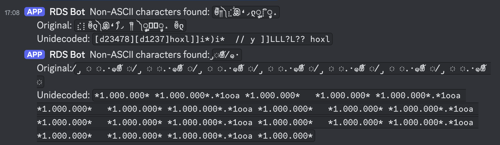

# wbor-rds-encoder

## Overview

Responsible for dynamically updating the RDS (Radio Data System) [RT (RadioText)](https://pira.cz/rds/show.asp?art=rds_encoder_support) displayed on car radios and other receivers. It takes in "Now Playing" track information from a radio station's logbook and processes it before transmitting to a [DEVA SmartGen Mini RDS encoder](https://devabroadcast.com/smartgen-mini). (*Other DEVA encoders are likely compatible with this app, but have not been tested.*)

***What is RDS, you ask? Read [this primer](https://pira.cz/rds/show.asp?art=rds_encoder_support).***


> [!NOTE]
> This does not take into account promotional station IDs or other messages that may be displayed on the RDS. This is designed to be a simple, plug-and-play solution for stations that want to display the currently playing track information on their RDS-enabled receivers. More advanced content cycles (with scheduling) could likely be implemented with some modification as a fork.

> [!NOTE]
> **This app is likely not suitable for transmitter networks** (stations who broadcast from more than one location). [UECP](https://www.rds.org.uk/2010/UECP.htm) is better designed for this, but not implemented in this app due to our station's single-transmitter usecase. From preliminary research, there are no features we "lose out on" (in our use) by choosing the SmartGen's ASCII communicational protocol. This is compounded by the fact that few reputable/battle-tested UECP libraries exist (that I could find).

## Features

- **RabbitMQ Consumer**: Consumes messages containing the currently playing track information. We use [Spinitron](https://spinitron.com/) as our source. (As for getting the messages published to this queue, read the [Data Flow](#data-flow) section.)
- **Text Processing & Filtering**:
  - Normalize text / unidecode to ASCII. Handles special characters by replacing them with question marks, though this can be customized.
  - Censors [profane words](https://raw.githubusercontent.com/zacanger/profane-words/master/words.json) to ensure appropriate broadcast content
- **RT (RadioText)**: a 64-character field that displays on newer FM receivers.
- **[RT+ (RadioText Plus)](https://tech.ebu.ch/docs/techreview/trev_307-radiotext.pdf)**: Allows certain receivers to parse metadata fields from the RT, such as artist and song name.
- **DEVA SmartGen Mini Integration**:
  - Maintains connection with the SmartGen Mini RDS encoder. As mentioned in the overview, this app is designed to work with the SmartGen Mini, but other DEVA encoders that use the same syntax may be compatible.
  - Sends processed messages following [SmartGen ASCII Programming Syntax constraints](https://github.com/WBOR-91-1-FM/wbor-rds-encoder/blob/main/docs/sg_mini_user_manual.pdf) (p. 34).
- **Parallel RDS Preview Publishing**:
  - Publishes processed text to a RabbitMQ exchange for consumption by a downstream preview module. For example, a web page or LED sign (e.g. BetaBrite) that reflects what is *currently being shown* by the RDS encoder.
- **Discord Logging**: In situations where text is unidecoded or profane words are censored, the original and processed text is logged to a Discord channel (defined in the `.env`) for monitoring and debugging purposes.

> [!WARNING]
> **DO NOT RELY ON THIS PROGRAM WHEN ACCURATE PROFANITY FILTERING IS CRUCIAL**. The profanity filter is not perfect and may not catch all instances of profanity. It is recommended to use a more robust profanity filter if this is a concern.

## Message Formatting

### SmartGen ASCII Syntax Rules (in brief)

- Messages use all-caps (capital letter) ASCII characters. The SmartGen Mini ignores ASCII inputs that do not conform to proper formatting rules.
  - Though the encoder will accept lowercase letters and all ASCII punctuation in the DPS and TEXT fields, RDS radio displays have limited character sets and may show ambiguous lowercase characters or gibberish. To assure readability, avoid fancy punctuation.
- Messages follow the format:

  ```txt
  {COMMAND}={VALUE}
  ```

  - The two commands we care about during regular operation of this app are `TEXT` (the RT field) and `RT+TAG`.

- The final response line from SmartGen will return:
  - `OK` if the command was successful.
  - `NO` if it failed.
- **Character limit:** 64 characters for `TEXT=` messages. Subsequently, RT+ also is bound by this limit and indices must be calculated accordingly.

## RT+

### Setting up RT+ for SmartGen Mini

To enable RT+ (RadioText Plus) for enhanced metadata parsing from FM receivers, configure the SmartGen Mini with the following:

1. **Set Group Sequence**
   - Connect to the encoder and run the command:

     ```txt
     SQC=0A,2A,3A,11A
     ```

   - This ensures the required RT+ signaling groups (11A and 3A) are active.
   - Information on what each of these represent is available in [this blog post](https://www.radioworld.com/news-and-business/lets-demystify-rds-radio-text-plus).

2. **Assign RT+ Data Group**
   - Set Group 11A as the RT+ data group:

     ```txt
     RT+GROUP=11A
     ```

### RT+ Message Formatting

RT+ requires specifying the offsets, lengths, and content type codes for each tagged item. The format (and accepted values) is as follows:

  ```txt
  <content_type_1>,    # 00-63
  <start_pos_1>,       # 00-63
  <length_1>,          # 00-63
  <content_type_2>,    # 00-63
  <start_pos_2>,       # 00-63
  <length_2>,          # 00-31
  <item_running_bit>,  # 0-1
  <timeout>            # 0-255 minutes
  ```

Each RT+ payload only supports two codes/tags. Take `Fireflies – OWL CITY – Ocean Eyes`. From this, we'd want to tag Title, Artist and Album. Accordingly, we would need two separate ODA payloads, because we have three things to tag and each ODA payload only supports two RT+ tags each. So, we need to create an RT+ ODA payload for Title and Artist, and then another tag for Album and a blank (null). Because the `Item.Toggle` bit will remain constant, the receiver should (but not necessarily, depending on the model) cache and cumulatively collect these tags as we interleave the transmission of these ODA payloads.

(The Item Toggle bit can't be set manually, since it's toggled automatically by the SmartGen each time the RT+TAG command is issued.)

## Architecture

The `docker-compose.yml` file defines the following services:

- **encoder**
  - Connection manager for the SmartGen Mini RDS encoder. Maintains a persistent TCP socket connection with the encoder and sends messages to it.
  - RabbitMQ consumer to incoming track information.
  - Message handling (processing and sending to the encoder).
- **dummy-smartgen**: *(Optional, enabled by default)* Simulate a SmartGen device for testing purposes (to see how data is received by the encoder if the hardware isn't available for testing).
- **rabbitmq**: *(Optional, enabled by default)* Exchange for incoming track information and outgoing RDS preview messages. Can use an external RabbitMQ instance if desired by changing the `RABBITMQ_HOST` environment variable in the `encoder` service.

## Data Flow

### Requirements

To get the relevant song information, your logbook source will need to publish messages to a RabbitMQ exchange. This app will consume these messages and process them before sending them to the SmartGen Mini.

The message payload requires that the following fields are present:

- `artist`
- `song`

The message should be in JSON format, like so:

```json
{
  "artist": "Owl City",
  "song": "Fireflies"
}
```

This app will simply concatenate the `artist` and `song` fields to form the RT and RT+ tags. The `artist` field will be the first tag, followed by the `song` field. The app will then send these tags to the SmartGen Mini.

```txt
TEXT=Owl City - Fireflies
```

### Example flow

This how we use it at WBOR. It is not a strict requirement for this app to be used in this way, but it is how we have implemented it (forks are welcome)!

1. Spinitron sends track metadata to an [API proxy](https://github.com/WBOR-91-1-FM/spinitron-proxy/)
2. An [API watchdog script](https://github.com/WBOR-91-1-FM/wbor-api-watchdog) sees that a new track is playing and publishes the data as a message to a RabbitMQ exchange
3. This app consumes the message, processes and sanitizes the text.
4. The processed RT and RT+ tags are sent to the SmartGen.
5. The processed text is published to a RabbitMQ exchange for downstream RDS previewing for sanity checking.

## Dependencies

There are two key packages that this app relies on that affect the message processing:

- **[Unidecode](https://pypi.org/project/Unidecode/)**: Converts Unicode characters to ASCII. This is important for ensuring that special characters are displayed correctly on RDS receivers.
- **[Profane words list](https://github.com/zacanger/profane-words)**: Used to censor profane words from the text.

If either of these change, it may affect the output of the app.

## Notes on the SmartGen Mini

By default, the SmartGen Mini encoder listens on ports `1024` and `1025`. These serve different purposes: one is designated for updating device configurations, while the other handles data traffic.

It's up to you to decide which port will be used for which function. Once you make this decision, **document it**—this will help prevent future headaches. Keep in mind that once a connection is established on a specific port, any additional connection attempts on the same port will be blocked.

For example, if this app is configured to send data to port `1024`, any attempt to connect to the encoder on this port while the app is running will fail, as the app maintains a continuous connection. To make changes to the encoder settings while the app is active, use the unoccupied port (in this case `1025`).

## Installation / Usage

### Production

1. Clone the repository:

2. In `encoder/`, copy the `.env.sample` file to `.env` and fill in the necessary values:

   ```bash
   cp .env.sample .env
   ```

3. Build the Docker container:

   ```bash
   docker compose up -d --build
   ```

4. To view the logs:

   ```bash
    docker compose logs -f
    ```

5. To stop the container:

    ```bash
    docker compose down

Alternatively, you can use the provided `Makefile` to build and run the container:

```bash
make
```

Or, if you're using in a Podman environment:

```bash
DOCKER_TOOL=podman make
```

### Development

```bash
docker compose --profile development up -d
```

Starts encoder, dummy_smartgen, and rabbitmq.

The `development` profile is used to start the dummy SmartGen and RabbitMQ services for testing purposes. The encoder service should be set to connect to the dummy SmartGen instead of the real one.

For Podman users, compose profiles are not supported. Each service will be started regardless of the profile specified.

## Notes

- This app only transmits `artist` and song `name` RT+ tags, as these appear to be the most universally supported tags across vehicles (as of the time of writing...).
  - [Full list of RDS RT+ Codes](https://msx.gay/radio/rtplus)
  - [Secondary source listing RDS RT+ Codes](https://pira.cz/rds/rtpclass.pdf)
- [Inspo for RT+ syntax](https://www.thimeo.com/documentation/fm_signal_settings.html)

## Known Limitations

Overall, unidecoding is a very imperfect science. It will not always yield a human-readable result, and it may not always be the most accurate representation of the original text. This is especially true for languages that are not based on the Latin alphabet. Take, for instance:



Also, the profanity filtering can be a bit overzealous. It may censor words that are not actually profane (e.g. `jamie xx` -> `jamie **`). This is a known limitation of the profanity list used in this app.

## Future Work

- Use an LLM for profanity filtering and unidecoding. This would allow for more accurate translations and profanity filtering. This would also allow for more accurate translations of non-Latin characters. Still probably not perfect, but likely better than what we have now in terms of catching edge cases or combinations that aren't accounted for.
- Add support for a whitelist of words that should not be censored. This would allow for more flexibility in the profanity filtering.
  - .txt file based
  - Discord bot callback to add words to the whitelist

## Contributing

Contributions are welcome! Please open an issue or pull request if you have any suggestions or improvements. It is our hope that more stations feel empowered to use RDS to bring their broadcasts into the modern era of radio tech.
